# メッセージフロー設計書

## シーケンス図

```mermaid
sequenceDiagram
    participant Client
    participant main.py
    participant message.py
    participant Claude API
    participant Tool

    Client->>main.py: prompt
    main.py->>Claude API: query()

    Note over Claude API,message.py: SystemMessage
    Claude API->>message.py: SystemMessage
    Note over main.py,Client: ❌ skip

    Note over Claude API,message.py: StreamEvent (message_start)
    Claude API->>message.py: StreamEvent<br/>(message_start)
    message.py->>main.py: handle_stream_event
    Note over main.py,Client: ❌ skip

    Note over Claude API,message.py: StreamEvent (content_block_start: text)
    Claude API->>message.py: StreamEvent<br/>(content_block_start: text)
    message.py->>main.py: handle_stream_event<br/>{"event": "content_block_start"}
    main.py->>Client: ✅ streaming start marker

    Note over Claude API,message.py: StreamEvent (content_block_delta: text)
    Claude API->>message.py: StreamEvent<br/>(delta: "I'll use")
    message.py->>main.py: handle_stream_event<br/>{"event": "I'll use"}
    main.py->>Client: ✅ "I'll use"

    Claude API->>message.py: StreamEvent<br/>(delta: " the multiply...")
    message.py->>main.py: handle_stream_event<br/>{"event": " the multiply..."}
    main.py->>Client: ✅ " the multiply..."

    Note over Claude API,message.py: StreamEvent (content_block_stop)
    Claude API->>message.py: StreamEvent<br/>(content_block_stop)
    message.py->>main.py: handle_stream_event<br/>{"event": "content_block_stop"}
    main.py->>Client: ✅ streaming end + newline

    Note over Claude API,message.py: AssistantMessage [TextBlock]
    Claude API->>message.py: AssistantMessage<br/>[TextBlock: "I'll use..."]
    message.py->>main.py: handle_assistant_message<br/>[] (empty)
    Note over main.py,Client: ❌ skip (already streamed)

    Note over Claude API,message.py: StreamEvent (content_block_start: tool_use)
    Claude API->>message.py: StreamEvent<br/>(content_block_start: tool_use)
    message.py->>main.py: handle_stream_event<br/>{"event": "🔧 multiply_numbers"}
    main.py->>Client: ✅ "🔧 multiply_numbers"

    Note over Claude API,message.py: StreamEvent (input_json_delta)
    Claude API->>message.py: StreamEvent<br/>(input_json_delta: {"a": 123...)
    message.py->>main.py: handle_stream_event<br/>None
    Note over main.py,Client: ❌ skip (too verbose)

    Note over Claude API,message.py: AssistantMessage [ToolUseBlock]
    Claude API->>message.py: AssistantMessage<br/>[ToolUseBlock]
    message.py->>main.py: handle_assistant_message<br/>[] (empty)
    Note over main.py,Client: ❌ skip (already notified)

    rect rgb(255, 250, 240)
        Note over Claude API,main.py: 🔐 ツール承認フロー (permission_mode="default")
        Claude API->>main.py: can_use_tool_with_approval<br/>(tool_name, input_data)
        main.py->>Client: tool_permission_request<br/>{"type": "tool_permission_request",<br/>"tool_name": "multiply_numbers",<br/>"input": {"a": 123, "b": 10000}}
        Note over Client: ⚠️ ユーザーに承認を求める
        Client->>Client: input("Approve? (y/n)")

        alt 承認された場合
            Client->>main.py: tool_permission_response<br/>{"approved": true}
            main.py->>Claude API: {"behavior": "allow"}
            Note over Claude API,Tool: ✅ ツール実行
            Claude API->>Tool: execute multiply_numbers
            Tool->>Claude API: 実行結果
        else 拒否された場合
            Client->>main.py: tool_permission_response<br/>{"approved": false}
            main.py->>Claude API: {"behavior": "deny"}
            Note over Claude API: ❌ ツール実行スキップ
        else タイムアウト (30秒)
            Note over main.py: asyncio.wait_for timeout
            main.py->>Claude API: {"behavior": "deny"}
            Note over Claude API: ⏱️ タイムアウト
        end
    end

    Note over Claude API,message.py: UserMessage [ToolResultBlock]
    Claude API->>message.py: UserMessage<br/>[ToolResultBlock: 123×10000=...]
    message.py->>main.py: handle_user_message<br/>{"result": "✅ multiply: 123×10000=..."}
    main.py->>Client: ✅ "✅ multiply: 123×10000=..."

    Note over Claude API,message.py: StreamEvent (content_block_start: text)
    Claude API->>message.py: StreamEvent<br/>(content_block_start: text)
    message.py->>main.py: handle_stream_event<br/>{"event": "content_block_start"}
    main.py->>Client: ✅ streaming start marker

    Note over Claude API,message.py: StreamEvent (content_block_delta: text)
    Claude API->>message.py: StreamEvent<br/>(delta: "The answer")
    message.py->>main.py: handle_stream_event<br/>{"event": "The answer"}
    main.py->>Client: ✅ "The answer"

    Claude API->>message.py: StreamEvent<br/>(delta: " is **1.23...")
    message.py->>main.py: handle_stream_event<br/>{"event": " is **1.23..."}
    main.py->>Client: ✅ " is **1.23..."

    Note over Claude API,message.py: StreamEvent (content_block_stop)
    Claude API->>message.py: StreamEvent<br/>(content_block_stop)
    message.py->>main.py: handle_stream_event<br/>{"event": "content_block_stop"}
    main.py->>Client: ✅ streaming end + newline

    Note over Claude API,message.py: AssistantMessage [TextBlock]
    Claude API->>message.py: AssistantMessage<br/>[TextBlock: "The answer..."]
    message.py->>main.py: handle_assistant_message<br/>[] (empty)
    Note over main.py,Client: ❌ skip (already streamed)

    Note over Claude API,message.py: ResultMessage
    Claude API->>message.py: ResultMessage<br/>(cost: $0.0127732)
    message.py->>main.py: handle_result_message<br/>{"result": "💰 Cost: $0.0127732"}
    main.py->>Client: ✅ "💰 Cost: $0.0127732"
```

## メッセージ種別と処理の対応表

| メッセージ種別 | 内部ブロック | クライアント送信 | 理由 |
|--------------|------------|----------------|------|
| **SystemMessage** | - | ❌ 送信しない | システム初期化情報、クライアント不要 |
| **StreamEvent** | | | |
| ├─ message_start | - | ❌ 送信しない | メッセージ開始通知、特に必要なし |
| ├─ message_stop | - | ❌ 送信しない | メッセージ終了通知、特に必要なし |
| ├─ content_block_start (text) | - | ✅ イベント送信 | ストリーミング開始マーカー |
| ├─ content_block_start (tool_use) | - | ✅ ツール名送信 | 🔧 ツール実行開始を通知 |
| ├─ content_block_stop | - | ✅ イベント送信 | ストリーミング終了マーカー |
| ├─ content_block_delta (text_delta) | - | ✅ テキスト送信 | **思考過程をリアルタイム表示** |
| └─ content_block_delta (input_json_delta) | - | ❌ 送信しない | ツール引数の途中経過は不要 |
| **AssistantMessage** | | | |
| ├─ TextBlock | - | ❌ 送信しない | 既にtext_deltaでストリーミング済み |
| ├─ ToolUseBlock | - | ❌ 送信しない | 既にcontent_block_startで通知済み |
| └─ ToolResultBlock | - | ❌ 送信しない | UserMessageで処理するため |
| **UserMessage** | | | |
| ├─ TextBlock | - | ❌ 送信しない | レア、重要でない |
| ├─ ToolUseBlock | - | ❌ 送信しない | tool_map登録のみ |
| └─ ToolResultBlock | - | ✅ 結果送信 | **✅ ツール実行結果** |
| **ResultMessage** | - | ✅ コスト送信 | **💰 最終コスト情報** |

## 送信内容の詳細

### ✅ クライアントに送信されるメッセージ

| タイミング | 内容 | フォーマット | 目的 |
|----------|------|------------|------|
| ストリーミング開始 | 開始マーカー | `{"event": "content_block_start"}` | ストリーミング境界の制御 |
| ツール実行開始 | ツール名 | `{"event": "🔧 multiply_numbers"}` | ツール実行の視覚的フィードバック |
| 思考過程 | テキストストリーム | `{"event": "I'll use"}` | エージェントの思考をリアルタイム表示 |
| ストリーミング終了 | 終了マーカー | `{"event": "content_block_stop"}` | ストリーミング終了、改行出力 |
| ツール実行結果 | 実行結果 | `{"result": "✅ multiply_numbers: 123×10000=1231231230000"}` | ツール実行の結果を通知 |
| 完了 | コスト情報 | `{"result": "💰 Cost: $0.0127732"}` | セッションコストを表示 |

### ❌ クライアントに送信されないメッセージ

| メッセージ | 理由 |
|----------|------|
| AssistantMessage の TextBlock | text_delta で既にストリーミング済み（重複排除） |
| AssistantMessage の ToolUseBlock | content_block_start で既に通知済み |
| input_json_delta | ツール引数の途中経過は冗長すぎる |
| SystemMessage | システム内部情報、クライアント不要 |
