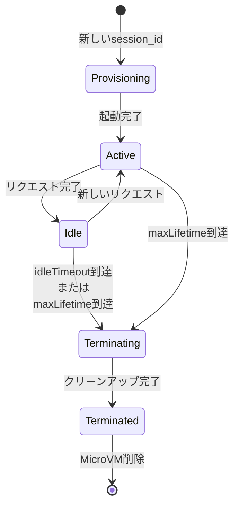

# MicroVMライフサイクル設計書

## 概要

AWS Bedrock AgentCore RuntimeはMicroVM（マイクロ仮想マシン）を使用してエージェントを実行します。各Runtime SessionはそれぞれのMicroVMで実行され、独立したファイルシステムとメモリ空間を持ちます。

## MicroVMの起動と識別

### Runtime Session ID

- 各`runtimeSessionId`は独立した専用MicroVMを取得
- 同じ`session_id`でリクエストを送ると、既存のMicroVMが再利用される（Idle/Active状態の場合）
- 新しい`session_id`は新しいMicroVMをプロビジョニング

```python
# 同じセッションIDで継続
websocket.connect(url, session_id="abc-123")  # MicroVM #1
websocket.connect(url, session_id="abc-123")  # 同じMicroVM #1を再利用

# 新しいセッションID
websocket.connect(url, session_id="xyz-789")  # 新しいMicroVM #2
```

## MicroVMのライフサイクル

### 状態遷移図



### 状態の詳細

| 状態 | 説明 | タイマー | データ保持 |
|------|------|---------|----------|
| **Provisioning** | MicroVM起動中 | なし | なし |
| **Active** | リクエスト処理中 | maxLifetimeのみ | あり |
| **Idle** | 待機中（次のリクエスト待ち） | idleTimeout + maxLifetime | あり |
| **Terminating** | 終了処理中（最大15秒） | なし | クリーンアップ中 |
| **Terminated** | MicroVM削除済み | なし | なし |

## シャットダウンタイミング

### 2つの重要なタイマー

#### 1. idleRuntimeSessionTimeout（アイドルタイムアウト）

- **デフォルト値: 900秒（15分）**
- **設定可能範囲: 60-28800秒（1分〜8時間）**
- **カウント条件: Idle状態のみ**
- **リセット: 新しいリクエストで0に戻る**

```yaml
# .bedrock_agentcore.yaml
runtime:
  idleRuntimeSessionTimeout: 900  # 15分
```

**挙動:**
```
リクエスト完了 → Idle状態
    ↓
15分以内に次のリクエスト → タイマーリセット、Active復帰
15分経過 → Terminated → MicroVM削除
```

#### 2. maxLifetime（最大生存時間）

- **デフォルト値: 28800秒（8時間）**
- **設定可能範囲: 60-28800秒（1分〜8時間）**
- **カウント条件: 常にカウント（Active/Idle両方）**
- **リセット: リセットされない（MicroVM作成時から固定）**

```yaml
# .bedrock_agentcore.yaml
runtime:
  maxLifetime: 28800  # 8時間
```

**挙動:**
```
MicroVM作成（10:00）
    ↓
18:00（8時間後）→ 強制終了
    ↓
リクエスト処理中でも終了する
```

### 重要なポイント

> **処理実行中（Active状態）はidle判定ではないため、idleTimeoutはカウントされません。**
>
> そのため、長時間のリクエスト処理中はmaxLifetimeのみが有効なタイマーとなります。

## 実用例

### 例1: 短い会話（デフォルト設定）

```
10:00:00 - リクエスト1開始 → MicroVM起動
10:00:30 - リクエスト1完了 → Idle状態（タイマー開始）
10:05:00 - リクエスト2開始 → Active復帰（タイマーリセット）
10:05:20 - リクエスト2完了 → Idle状態（タイマー再開）
10:10:00 - リクエスト3開始 → Active復帰（タイマーリセット）
10:10:45 - リクエスト3完了 → Idle状態（タイマー再開）
10:25:45 - 15分経過 → MicroVM削除
```

### 例2: 長時間のリクエスト処理

```
10:00:00 - 長時間処理開始 → MicroVM起動
10:00:00〜17:00:00 - Active状態（7時間の処理）
    ↓
idleTimeoutはカウントされない
maxLifetimeはカウントされる
    ↓
18:00:00 - maxLifetime到達 → 処理中でも強制終了
```

### 例3: WebSocket接続との関係

```
10:00 - WebSocket接続 + リクエスト1
10:05 - リクエスト1完了（WebSocket接続継続）
10:10 - WebSocket接続タイムアウト（60分制限）で切断
    ↓
MicroVMはまだIdle状態で存在
    ↓
10:20 - 同じsession_idで再接続 → 同じMicroVM再利用
10:30 - リクエスト2送信 → 状態保持されている
```

## タイムアウト設定の推奨値

### ユースケース別推奨設定

| ユースケース | idleTimeout | maxLifetime | 理由 |
|------------|-------------|-------------|------|
| **対話型チャット** | 900秒（15分） | 28800秒（8時間） | デフォルト、バランス良い |
| **長時間バッチ処理** | 60秒（1分） | 28800秒（8時間） | 処理終了後すぐ解放、コスト削減 |
| **頻繁な短いリクエスト** | 3600秒（1時間） | 28800秒（8時間） | ウォームスタート維持 |
| **デモ・テスト環境** | 300秒（5分） | 3600秒（1時間） | リソース節約 |

### 設定例

```yaml
# .bedrock_agentcore.yaml
runtime:
  # 対話型チャット（デフォルト）
  idleRuntimeSessionTimeout: 900    # 15分
  maxLifetime: 28800                # 8時間

  # 長時間バッチ処理
  # idleRuntimeSessionTimeout: 60   # 1分
  # maxLifetime: 28800              # 8時間

  # 頻繁な短いリクエスト
  # idleRuntimeSessionTimeout: 3600 # 1時間
  # maxLifetime: 28800              # 8時間
```

## WebSocket接続の制限

### WebSocket最大接続時間

- **制限: 60分**
- WebSocket接続は最大60分で自動切断
- **MicroVMは切断後も存続**（idleTimeoutまで）
- 再接続すれば同じMicroVMを再利用可能

```
10:00 - WebSocket接続
11:00 - 60分経過 → WebSocket自動切断
    ↓
MicroVMはIdle状態で存続（15分間）
    ↓
11:10 - 同じsession_idで再接続 → 状態保持
```

### 同期リクエストのタイムアウト

- **HTTP同期リクエスト: 15分**
- 15分を超える処理は強制終了
- 長時間処理にはWebSocketを推奨

## データの永続性

### セッション内の状態保持

| データ種類 | Active状態 | Idle状態 | Terminated後 |
|----------|-----------|---------|-------------|
| メモリ | ✅ 保持 | ✅ 保持 | ❌ 削除 |
| ファイルシステム | ✅ 保持 | ✅ 保持 | ❌ 削除 |
| 環境変数 | ✅ 保持 | ✅ 保持 | ❌ 削除 |
| Claude SDK Session | ✅ 保持 | ✅ 保持 | ❌ 削除 |

### 永続化が必要なデータ

**セッション終了後も保持したいデータは別途永続化が必要:**

1. **AgentCore Memory**（推奨）
   - 会話履歴、ユーザー情報
   - 7-365日保持可能
   - セマンティック検索可能

2. **S3**
   - 大容量ファイル
   - ログ、レポート
   - 無制限保持

3. **DynamoDB**
   - メタデータ、セッション管理
   - 高速クエリが必要なデータ

## Runtime SessionとClaudeAgentSDK Sessionの関係

### 2種類のセッションID

| セッションID | レイヤー | 役割 | 管理者 |
|------------|---------|------|--------|
| **Runtime Session ID** | インフラ | MicroVMの識別・管理 | AgentCore Runtime |
| **ClaudeAgentSDK Session ID** | アプリケーション | 会話履歴の識別・管理 | Claude Agent SDK |

### 依存関係

```
Runtime Session (MicroVM)
    ├─ ファイルシステム
    │   └─ ~/.claude/projects/-var-task/<claude_session_id>.jsonl
    └─ メモリ
        └─ ClaudeSDKClient(resume=claude_session_id)
```

**重要:**
- Runtime Sessionが終了すると、その中のすべてのアプリケーション状態（Claude SDK Sessionを含む）が失われる
- Claude SDK Sessionを永続化するには、AgentCore Memoryなどの外部ストレージが必要

## アカウント制限

### 同時セッション数

| リージョン | 最大同時セッション数 |
|----------|-----------------|
| us-east-1, us-west-2 | 1,000 |
| その他のリージョン | 500 |

### 増量リクエスト

- Service Quotasコンソールから申請可能
- ビジネスニーズに応じて増量可能

## ベストプラクティス

### 1. セッションIDの設計

```python
# 推奨: UUIDv4を使用
import uuid

runtime_session_id = str(uuid.uuid4())  # "abc-123-def-456"
claude_session_id = str(uuid.uuid4())   # "xyz-789-uvw-012"
```

### 2. タイムアウトの監視

```python
import time

session_start = time.time()
max_lifetime = 8 * 3600  # 8時間

while True:
    elapsed = time.time() - session_start
    if elapsed > max_lifetime - 600:  # 10分前に警告
        log.warning("Approaching maxLifetime, save state!")
```

### 3. グレースフルシャットダウン

```python
@app.websocket
async def websocket_handler(websocket, context):
    try:
        # 処理
        pass
    finally:
        # セッション保存
        await save_session(claude_session_id, memory_id)
```

### 4. エラーハンドリング

```python
try:
    response = await client.query(prompt)
except TimeoutError:
    # maxLifetime到達
    log.error("MicroVM terminated due to maxLifetime")
    await save_session_emergency(claude_session_id)
```

## トラブルシューティング

### Q: セッションが予期せず終了する

**原因:**
- idleTimeout到達（15分間リクエストなし）
- maxLifetime到達（8時間経過）
- WebSocket切断をセッション終了と誤認

**対策:**
- タイムアウト値を確認
- ログで実際の経過時間を確認
- WebSocket切断 ≠ セッション終了を理解

### Q: 状態が保持されない

**原因:**
- 異なるsession_idでリクエスト
- セッションが既にTerminated

**対策:**
- 同じsession_idを使用しているか確認
- idleTimeout以内にリクエストを送る
- AgentCore Memoryで永続化

### Q: 長時間処理が途中で終了する

**原因:**
- maxLifetime到達（8時間制限）

**対策:**
- 処理を分割してチェックポイント保存
- AgentCore Memoryで中間状態を保存
- 必要に応じて新しいセッションで再開

## 関連ドキュメント

- [セッション永続化設計書](./session-persistence.md) - Claude SDK Sessionの永続化方法
- [メッセージフロー設計書](./message-flow.md) - WebSocketメッセージ処理
- [AgentCore Runtime公式ドキュメント](https://docs.aws.amazon.com/bedrock/latest/userguide/agents-runtime.html)

## 参考情報

### 重要な数値まとめ

| 項目 | デフォルト値 | 設定可能範囲 |
|------|------------|------------|
| idleRuntimeSessionTimeout | 900秒（15分） | 60-28800秒 |
| maxLifetime | 28800秒（8時間） | 60-28800秒 |
| WebSocket最大接続時間 | 3600秒（60分） | 固定 |
| 同期リクエストタイムアウト | 900秒（15分） | 固定 |
| 終了処理時間 | 最大15秒 | 固定 |
| 同時セッション数（us-east-1） | 1,000 | 増量可能 |

### ライフサイクルの流れ（完全版）

```
1. 新しいsession_id → Provisioning（起動）
2. 起動完了 → Active（リクエスト処理）
3. リクエスト完了 → Idle（待機）
   - idleTimeoutカウント開始
   - maxLifetimeは継続カウント
4. 新しいリクエスト → Active（復帰）
   - idleTimeoutリセット
   - maxLifetimeは継続
5. 終了条件:
   - idleTimeout到達（15分）または
   - maxLifetime到達（8時間）
   → Terminating（終了処理）
6. クリーンアップ完了 → Terminated（削除）
```
