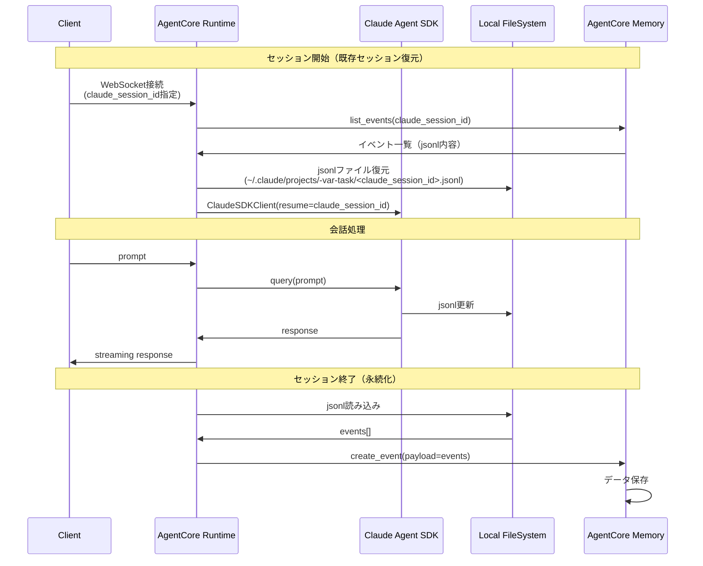

# セッション永続化設計書

## 背景

ClaudeAgentSDKは `~/.claude/projects/-var-task/<session_id>.jsonl` にセッション情報を保存しますが、AgentCore RuntimeはMicroVMごとにローカルファイルシステムが独立しているため、リクエスト間でセッションファイルが失われます。

## 課題

- **MicroVMの一時性**: セッション終了時に全てのディスクデータが削除される
- **セッション継続の必要性**: ユーザーとの会話履歴を保持して、文脈を維持したい
- **2種類のセッションID**:
  - `claude_session_id`: Claude Agent SDKのセッションID（会話履歴の識別子）
  - `agent_session_id`: AgentCore RuntimeのセッションID（WebSocket接続の識別子）

## 解決策: AgentCore Memory を使用

### 概要

AWS AgentCore Memoryの**Short-term Memory**機能を使って、jsonlファイルの内容をイベントとして永続化します。

### アーキテクチャ



## 実装方針

### 1. セッション開始時（復元）

```python
from bedrock_agentcore.client import BedrockAgentCoreDataClient
import json
from pathlib import Path

async def restore_session(claude_session_id: str, memory_id: str):
    """AgentCore Memoryからセッションを復元"""
    if not claude_session_id:
        return  # 新規セッション

    # AgentCore Memoryからイベント取得
    data_client = BedrockAgentCoreDataClient()
    response = data_client.list_events(
        memoryId=memory_id,
        maxResults=100,  # 必要に応じて調整
        # claude_session_idでフィルタリング（メタデータ検索）
    )

    # イベントからjsonl内容を抽出
    events = []
    for event in response.get('events', []):
        if event['payload'].get('claude_session_id') == claude_session_id:
            events.extend(event['payload']['content'])

    if not events:
        return  # セッションが見つからない

    # jsonlファイルに書き込み
    session_file = Path.home() / ".claude" / "projects" / "-var-task" / f"{claude_session_id}.jsonl"
    session_file.parent.mkdir(parents=True, exist_ok=True)

    with open(session_file, "w") as f:
        for event in events:
            f.write(json.dumps(event) + "\n")

    log.info(f"Session restored: {claude_session_id}, {len(events)} events")
```

### 2. セッション終了時（保存）

```python
async def save_session(claude_session_id: str, agent_session_id: str, memory_id: str, user_id: str):
    """セッションをAgentCore Memoryに保存"""
    if not claude_session_id:
        return  # セッションIDがない場合はスキップ

    # jsonlファイルを読み込み
    session_file = Path.home() / ".claude" / "projects" / "-var-task" / f"{claude_session_id}.jsonl"
    if not session_file.exists():
        log.warning(f"Session file not found: {session_file}")
        return

    events = []
    with open(session_file, "r") as f:
        for line in f:
            if line.strip():
                events.append(json.loads(line))

    # AgentCore Memoryにイベントとして保存
    data_client = BedrockAgentCoreDataClient()
    data_client.create_event(
        memoryId=memory_id,
        actorId=user_id,
        sessionId=agent_session_id,  # AgentCore RuntimeのセッションID
        payload={
            'type': 'CONVERSATION',
            'claude_session_id': claude_session_id,  # Claude SDKのセッションID
            'content': events,  # jsonlの中身
            'event_count': len(events)
        },
        metadata={
            'source': 'claude_agent_sdk',
            'claude_session_id': claude_session_id,  # 検索用
            'timestamp': datetime.utcnow().isoformat()
        }
    )

    log.info(f"Session saved: {claude_session_id}, {len(events)} events")
```

### 3. main.pyへの統合

```python
@app.websocket
async def websocket_handler(websocket, context):
    """WebSocket handler with session persistence"""
    await websocket.accept()

    try:
        # クライアントからメッセージ受信
        data = await websocket.receive_json()
        prompt = data.get("prompt")
        claude_session_id = data.get("session_id")  # Claude SDKのセッションID
        agent_session_id = context.get("session_id")  # AgentCore RuntimeのセッションID

        # Memory設定（.bedrock_agentcore.yamlから取得）
        memory_id = "hello_agent_mem-IwM6eD5kAp"  # 設定ファイルから
        user_id = "default_user"  # 必要に応じて動的に設定

        # セッション復元
        await restore_session(claude_session_id, memory_id)

        # Claude Agent SDK初期化
        options = ClaudeAgentOptions(
            model="claude-sonnet-4-5",
            allowed_tools=[...],
            mcp_servers={"tools": tools_server},
            can_use_tool=can_use_tool_with_approval,
            permission_mode="default",
            system_prompt="...",
            max_turns=10,
            include_partial_messages=True,
            resume=claude_session_id,  # セッション復元
        )

        async with ClaudeSDKClient(options=options) as client:
            await client.query(prompt)

            # レスポンス処理...
            async for msg in client.receive_response():
                # メッセージ処理
                pass

        # セッション保存
        await save_session(claude_session_id, agent_session_id, memory_id, user_id)

    except Exception as e:
        log.error(f"WebSocket error: {e}")
    finally:
        await websocket.close()
```

## 設定

### .bedrock_agentcore.yaml

```yaml
memory:
  id: hello_agent_mem-IwM6eD5kAp
  name: hello_agent_memory
  mode: STM_AND_LTM
  retention:
    eventExpiryInDays: 30
```

## セッションIDの使い分け

| ID種別 | 用途 | 例 | 保存先 |
|--------|------|-----|--------|
| `claude_session_id` | Claude Agent SDKの会話履歴識別 | `"2fad0550-5bf4-40d0-9445-5b0aaac392d8"` | jsonlファイル名、Memory payload |
| `agent_session_id` | AgentCore RuntimeのWebSocket接続識別 | `"887dc3b6-3c0e-43e6-9651-635c3ce24ea9"` | Memory sessionId |

## データフロー

### 新規セッション

```
Client → AgentCore Runtime → Claude SDK
                           ↓
                    jsonl作成 (new session_id)
                           ↓
                    応答生成 & jsonl更新
                           ↓
                    AgentCore Memory保存
```

### 既存セッション復元

```
Client (session_id指定) → AgentCore Runtime
                                ↓
                        AgentCore Memory検索
                                ↓
                        jsonl復元 → Claude SDK
                                ↓
                        応答生成 & jsonl更新
                                ↓
                        AgentCore Memory更新
```

## 注意事項

### 1. セッションIDの命名

- Claude SDKが生成する`session_id`をそのまま使用
- `agent_session_id`は別途管理（WebSocket接続ごと）

### 2. エラーハンドリング

- jsonlファイルが見つからない場合はスキップ
- Memory保存失敗時はログに記録するが、処理は継続

### 3. パフォーマンス

- 大量のイベント（>1000件）がある場合は、ページネーション実装を検討
- 必要に応じてイベントを圧縮

### 4. セキュリティ

- `actorId`（user_id）は適切に認証・検証する
- Memory APIの呼び出しにはIAM権限が必要

## 今後の拡張

### Phase 1: 基本的な永続化（MVP）
- [x] 調査完了
- [ ] セッション復元機能実装
- [ ] セッション保存機能実装
- [ ] main.pyへの統合

### Phase 2: 改善
- [ ] ページネーション対応（大量イベント）
- [ ] エラーリトライロジック
- [ ] メトリクス・ロギング強化

### Phase 3: 高度な機能
- [ ] Long-term Memoryでの要約・検索
- [ ] セッションブランチング
- [ ] チェックポイント機能

## 参考リンク

- [AWS Bedrock AgentCore Memory Documentation](https://docs.aws.amazon.com/bedrock/latest/userguide/agents-memory.html)
- [Claude Agent SDK Documentation](https://github.com/anthropics/anthropic-sdk-python)
- プランファイル: `/Users/yuyamm/.claude/plans/tingly-swimming-hopcroft-agent-a2a27c4.md`
